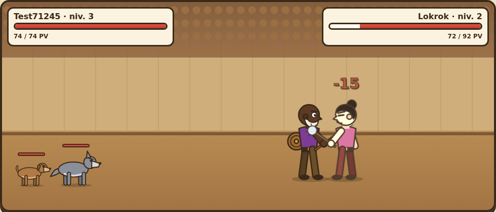
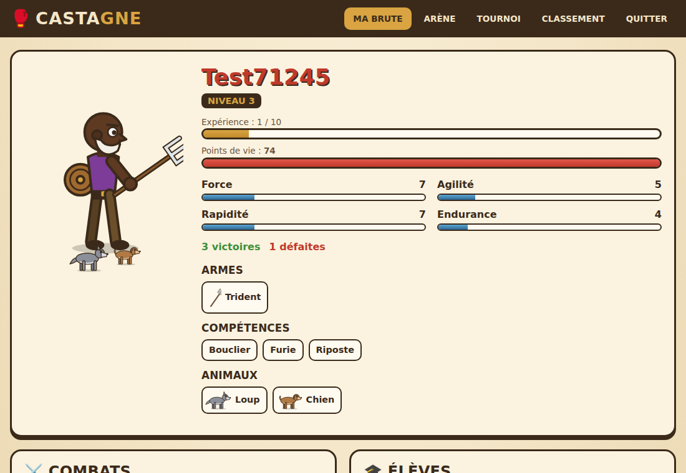
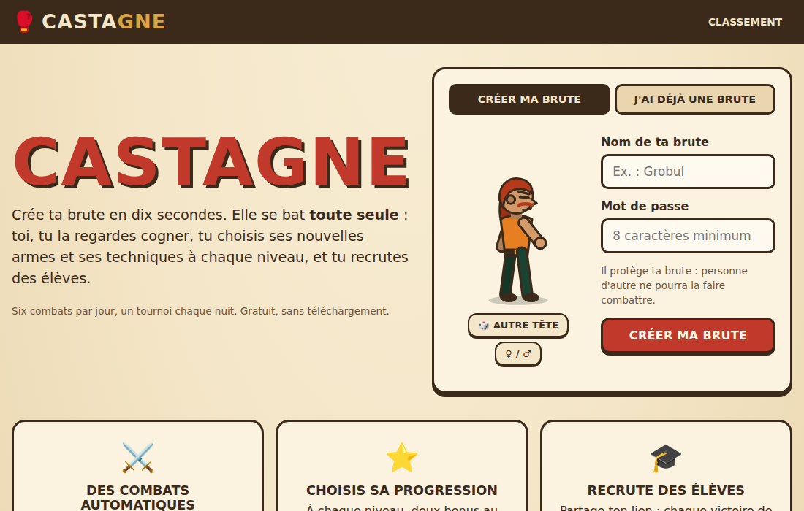

# 🥊 Castagne — le jeu de combat de brutes

**Castagne** est un jeu de combat par navigateur. On crée une brute en dix secondes, et elle se bat **toute
seule** : esquives, parades, contre-attaques, armes lancées, animaux qui s'en mêlent. Le joueur regarde le combat,
choisit à chaque niveau entre deux bonus, recrute des élèves et inscrit sa brute au tournoi de la nuit.

Il reprend le principe des jeux de « brutes » des années 2000 avec son propre nom, ses propres règles et ses
propres dessins : tout est dessiné en SVG par le code, rien n'est repris d'un jeu existant.



## ✨ Le jeu

| | |
|---|---|
| 🧑‍🎨 **Création express** | un nom, un mot de passe, une tête tirée au sort (« Autre tête » pour en changer) : 20 points de caractéristiques répartis au hasard et un premier bonus |
| ⚔️ **Combats automatiques** | le serveur simule le combat, le navigateur le rejoue en animation avec un journal détaillé ; vitesse réglable ou résultat immédiat |
| 🏟️ **L'arène** | 6 combats par jour contre des brutes de niveau proche ; s'il manque des joueurs, des brutes sauvages les remplacent |
| ⭐ **Niveaux** | 2 points d'expérience par victoire, 1 par défaite ; à chaque niveau, deux bonus au choix : caractéristiques, arme, compétence ou animal |
| 🗡️ **20 armes** | du couteau au marteau de guerre, en passant par la poêle, le fouet ou le shuriken : chacune a ses dégâts, sa vitesse et ses bonus (parade, contre, enchaînement, désarmement, lancer) |
| ✨ **18 compétences** | Bouclier, Riposte, Furie, Increvable, Second souffle, Cri de guerre, Poings d'acier, Lanceur d'élite… |
| 🐺 **4 animaux** | jusqu'à trois chiens, un loup, une panthère et un ours, qui combattent aux côtés de la brute |
| 🎓 **Élèves** | chaque brute a un lien d'invitation ; chaque victoire d'un élève rapporte 1 point d'expérience au maître |
| 🏆 **Tournoi quotidien** | les inscrits se retrouvent à minuit par tableaux de huit : 1 point par victoire, 5 de plus pour le vainqueur ; le tableau et chaque combat se revoient |
| 📜 **Fiches publiques** | chaque brute, chaque combat et le classement ont leur adresse, à partager |

| La fiche d'une brute | L'accueil |
|---|---|
|  |  |

## 🚀 Lancer Castagne

```bash
python3 -m castagne          # puis ouvrir http://127.0.0.1:8080/
```

Aucune dépendance : bibliothèque standard de Python uniquement (Castagne partage le module de sécurité de
[Rédigo](../redigo/README.md)).

Pour le mettre en ligne, derrière un serveur HTTPS (Caddy, Nginx…) :

```bash
CASTAGNE_URL=https://castagne.example CASTAGNE_DERRIERE_PROXY=1 python3 -m castagne lancer --hote 0.0.0.0
```

| Variable | Rôle |
|---|---|
| `CASTAGNE_URL` | l'adresse publique (active le cookie `Secure` en HTTPS) |
| `CASTAGNE_BASE` | le fichier SQLite (par défaut `castagne/donnees/castagne.db`) |
| `CASTAGNE_FUSEAU` | le fuseau horaire du jour de jeu, `Europe/Paris` par défaut : les combats reviennent et le tournoi se dispute à minuit dans ce fuseau |
| `CASTAGNE_DERRIERE_PROXY` | `1` pour lire l'adresse du joueur dans `X-Forwarded-For` (limitation des tentatives) |

## ⚖️ Les règles du combat

Chaque combattant (la brute et ses animaux) a une horloge. Le prochain à agir est celui dont l'horloge est la plus
en retard ; chaque action l'avance selon sa **rapidité** et le poids de son arme. À son tour, une brute peut
sortir une arme de sa réserve, lancer une arme de jet, ou attaquer :

- l'**esquive** dépend de l'écart d'**agilité** et des armes des deux combattants ;
- la **parade** vient de l'arme (bâton, poêle, épée…) ou de la compétence Bouclier ;
- les **dégâts** additionnent l'arme et la **force**, à ±20 % près ;
- après un coup, l'attaquant peut **enchaîner** (rapidité, Furie, nunchaku…) et le défenseur **contre-attaquer**
  (lance, trident, Riposte…) ;
- les **points de vie** valent 50 + 6 × **endurance**.

Le combat s'arrête dès qu'une des deux brutes est au tapis. Il est entièrement déterminé par une graine : le
serveur l'enregistre, et chacun peut le revoir à l'identique. L'équilibre a été réglé par des milliers de combats
simulés : une compétence ou une arme vaut à peu près un gain de caractéristiques, et aucune ne gagne à coup sûr.

## 🔐 Sécurité

- Mot de passe par brute, haché avec **scrypt** ; jetons de session gardés hachés ; tentatives limitées.
- Cookie `HttpOnly`, `SameSite=Lax` (`Secure` en HTTPS) et en-tête `X-Castagne` obligatoire sur toute action
  (protection CSRF). En-têtes `Content-Security-Policy` (aucun script extérieur ni en ligne), `X-Frame-Options`,
  `nosniff`.
- Tout est calculé par le serveur : le navigateur ne fait que rejouer. Impossible de tricher sur un combat, sur
  l'expérience ou sur le nombre de combats du jour (chaque combat se fait dans une transaction `BEGIN IMMEDIATE`).
- Les noms sont limités aux lettres, chiffres et tirets, et tout texte est échappé à l'affichage.

## 🔬 Comment c'est construit

| Fichier | Rôle |
|---------|------|
| `regles.py` | les caractéristiques, les armes, les compétences, les animaux, les niveaux et l'apparence |
| `combat.py` | la simulation d'un combat, qui produit la liste des événements à rejouer |
| `jeu.py` | la partie : création, arène, expérience, choix de niveau, élèves, tournois |
| `base.py` | la base SQLite et les sessions |
| `serveur.py` | le serveur HTTP et l'API |
| `web/commun.js` | les dessins SVG des brutes (7 coiffures, 6 teints, barbes, yeux, carrure), des animaux et des armes |
| `web/combat.js` | la relecture animée des combats |
| `web/jeu.js`, `web/accueil.js` | les écrans du jeu (JavaScript sans bibliothèque) |

## ✅ Tests

```bash
python3 -m unittest tests.test_castagne
```

Ils vérifient :
- la cohérence des règles ;
- qu'un combat se rejoue à l'identique et que ses événements sont cohérents (points de vie, KO, vainqueur) ;
- que les armes comptent ;
- la limite quotidienne, le passage de niveau et l'expérience mise de côté pendant un choix ;
- l'expérience des maîtres et les tournois, à huit ou à plus ;
- un parcours complet par l'API : protection CSRF, connexion, fiches publiques sans données privées.

## 💡 Pistes pour aller plus loin

- Des **clans** qui s'affrontent en guerre, et des classements par clan
- Des **objets de soutien** (potions, filets, bombes) à usage unique pendant un combat
- Des **sons** et une musique d'arène
- Une **application installable** (PWA) avec notification quand les combats du jour sont revenus
