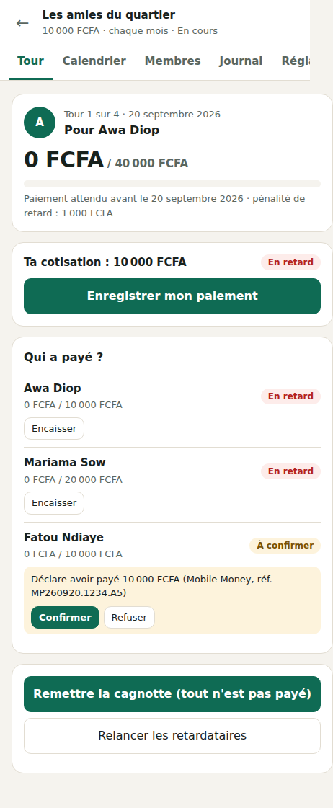
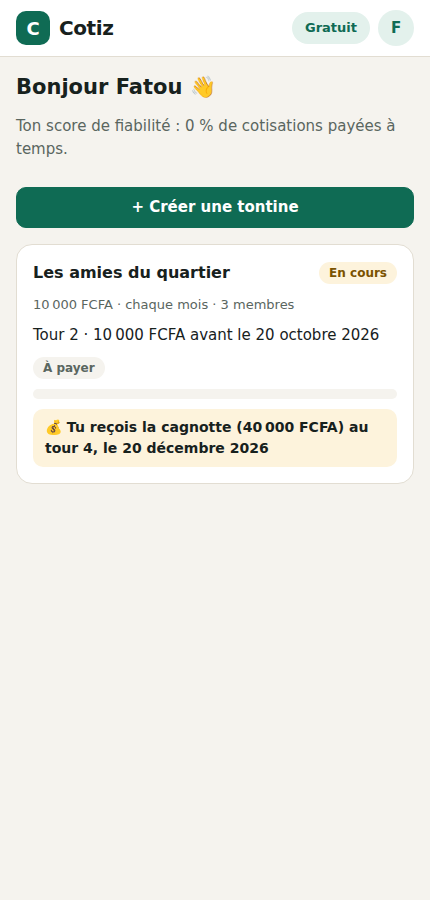
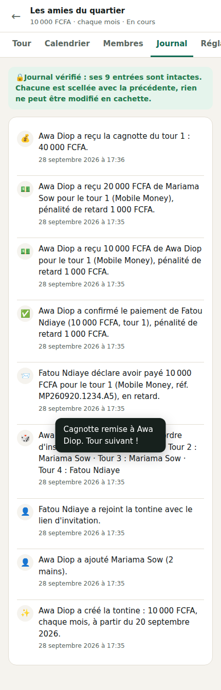
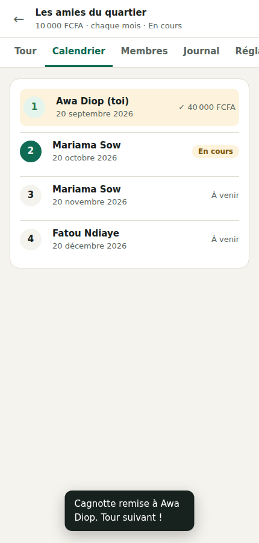

# 🤝 Cotiz — la tontine en ligne, sans les disputes

**Cotiz** organise les tontines (njangi, susu, likelemba, esusu…) : le calendrier des tours, qui a payé, qui est
en retard, qui reçoit la cagnotte, avec des rappels prêts à envoyer sur WhatsApp et un **journal infalsifiable**
que tous les membres peuvent consulter.



## ✨ Ce que fait Cotiz

| | |
|---|---|
| 📅 **Calendrier automatique** | chaque semaine, quinzaine ou mois ; bénéficiaires tirés au sort, par ordre d'inscription ou choisis par l'organisateur |
| ✋ **Plusieurs mains** | un membre peut cotiser pour 2, 3… mains : il paie autant de fois la cotisation et reçoit autant de cagnottes |
| 📱 **Mobile Money et espèces** | le membre déclare son paiement avec la référence de la transaction, l'organisateur confirme ou refuse ; les espèces s'enregistrent directement |
| ⏰ **Retards et pénalités** | délai de grâce, pénalité fixe appliquée toute seule, retard jugé à la date de la déclaration (une confirmation tardive ne pénalise pas le membre) |
| 💬 **Rappels WhatsApp et SMS** | un message poli, déjà rédigé, pour chaque retardataire, en un clic |
| 💰 **Remise de la cagnotte** | bloquée tant que tout le monde n'a pas payé, sauf décision explicite de l'organisateur (les impayés restent alors notés) |
| 🔒 **Journal infalsifiable** | chaque action est scellée avec l'empreinte SHA-256 de la précédente : une ligne modifiée ou effacée après coup est détectée et signalée à tous |
| ⭐ **Score de fiabilité** | la part des cotisations payées à temps, toutes tontines confondues, visible par les organisateurs |
| 🔗 **Invitation par lien** | l'organisateur partage un lien sur WhatsApp ; il peut aussi ajouter des membres sans smartphone, qui retrouvent la tontine s'ils créent un compte plus tard avec leur numéro |
| 📊 **Export Excel** | toutes les cotisations, tour par tour (formule Organisateur) |

Les membres ne voient que les noms et les statuts de paiement : **les numéros de téléphone ne sont montrés qu'à
l'organisateur**. Cotiz ne détient jamais l'argent : il circule comme d'habitude, Cotiz tient les comptes.

| Le tableau de bord d'un membre | Le journal | Le calendrier |
|---|---|---|
|  |  |  |

## 🚀 Lancer Cotiz

```bash
python3 -m cotiz          # puis ouvrir http://127.0.0.1:8070/
```

Aucune dépendance : Cotiz n'utilise que la bibliothèque standard de Python (il partage le module de sécurité de
[Rédigo](../redigo/README.md)). Par défaut, il est en **mode démonstration** : la formule Organisateur s'active
sans payer.

## 💳 Les formules

| | Gratuit | Organisateur |
|---|---|---|
| Prix | 0 | 2 000 FCFA (3 €) par mois |
| Participer à des tontines | illimité | illimité |
| Tontines organisées en même temps | 1 | 20 |
| Membres par tontine | 15 | 100 |
| Export Excel | — | ✓ |

Les membres ne paient jamais : seuls les organisateurs qui gèrent plusieurs tontines ou de grands groupes paient. Pour
offrir la formule à un compte :

```bash
python3 -m cotiz formule "+221 77 123 45 67" --jours 365
```

## 🌍 Mettre Cotiz en ligne

| Variable | Rôle |
|----------|------|
| `COTIZ_URL` | l'adresse publique (pour les liens d'invitation et les cookies `Secure` en HTTPS) |
| `COTIZ_BASE` | le fichier de la base SQLite (à sauvegarder régulièrement) |
| `COTIZ_DEMO` | `1` (par défaut) : la formule s'active sans paiement ; `0` en production tant qu'aucun paiement n'est branché |
| `COTIZ_DERRIERE_PROXY` | `1` : l'adresse du visiteur est lue dans `X-Forwarded-For` (limitation des tentatives de connexion) |

```bash
COTIZ_URL=https://cotiz.exemple.com COTIZ_DEMO=0 python3 -m cotiz lancer --hote 0.0.0.0 --port 8070
```

## 🔐 Sécurité

- Connexion par numéro de téléphone et mot de passe haché avec **scrypt** ; jetons de session gardés hachés.
- Cookie `HttpOnly`, `SameSite=Lax` (`Secure` en HTTPS) et en-tête `X-Cotiz` obligatoire sur toute modification
  (protection CSRF). En-têtes `Content-Security-Policy`, `X-Frame-Options`, `nosniff`, `Referrer-Policy`.
- Une tontine n'est visible que par ses membres : pour les autres, elle « n'existe pas ». Seul l'organisateur
  modifie, confirme, verse et voit les numéros.
- Les tentatives de connexion et d'inscription sont limitées.
- Les montants sont des entiers (francs CFA, centimes d'euro…) : jamais d'erreur d'arrondi.
- Chaque écriture se fait dans une transaction `BEGIN IMMEDIATE` : deux actions simultanées ne peuvent pas
  casser la chaîne du journal.

## 🔬 Comment c'est construit

| Fichier | Rôle |
|---------|------|
| `tontine.py` | les règles : membres, ordre, tours, cotisations, pénalités, versements, fiabilité, rappels, journal scellé |
| `calendrier.py` | les dates des tours (fins de mois comprises) et les montants dans chaque monnaie |
| `base.py` | la base SQLite et les comptes |
| `serveur.py` | le serveur HTTP et l'API |
| `web/` | la page d'accueil et l'application, pensées d'abord pour le téléphone (HTML, CSS, JavaScript sans bibliothèque) |

## ✅ Tests

```bash
python3 -m unittest tests.test_cotiz
```

Ils couvrent les dates (fins de mois, années bissextiles), les montants, un cycle complet de paiement avec
pénalités et rappels, le tirage au sort, la fin de la tontine, la détection d'un journal modifié ou amputé, les
droits (un intrus ne voit rien, un membre ne peut ni démarrer ni confirmer) et un parcours complet par l'API.

## 💡 Pistes pour aller plus loin

- Le **paiement Mobile Money intégré** (Wave, Orange Money, MTN MoMo via un agrégateur) avec confirmation automatique
- L'**envoi automatique** des rappels par SMS ou WhatsApp Business la veille de chaque échéance
- Une **application installable** (PWA) qui fonctionne aussi hors connexion
- Les tontines **à enchères**, où l'ordre des bénéficiaires se décide par offres
