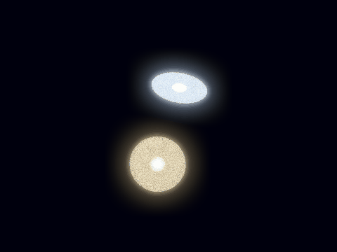
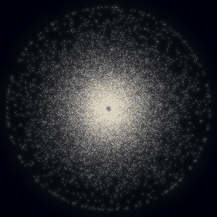

# 🌌 Galaxie — un simulateur de galaxies

**Galaxie** simule des dizaines de milliers d'étoiles qui s'attirent par la gravité. On y voit deux galaxies
entrer en collision et s'arracher des **queues de marée**, ou des **bras spiraux** apparaître tout seuls dans un
disque d'étoiles. Il est écrit en Python avec NumPy, et utilise l'**algorithme de Barnes-Hut**, celui des
astrophysiciens.



*Deux galaxies spirales se frôlent (60 000 étoiles). Leurs étoiles sont arrachées en longues queues de marée et
en un pont qui les relie, exactement comme dans les galaxies réelles des Antennes ou des Souris.*



*Un disque de 25 000 étoiles qui s'attirent toutes entre elles, dans un halo de matière noire. Personne ne dessine
les bras spiraux : ils naissent de minuscules irrégularités que la gravité amplifie.*

## 🚀 Lancer une simulation

```bash
pip install numpy pillow
python3 -m galaxie collision                  # → galaxie/sorties/collision.gif (et .png pour la dernière image)
python3 -m galaxie spirale                    # ~10 minutes sur un processeur à 4 cœurs
python3 -m galaxie amas
python3 -m galaxie collision --etoiles 100000 --largeur 800 --hauteur 600 --sortie grande.gif
```

| Option | Effet |
|--------|-------|
| `--etoiles 50000` | nombre d'étoiles |
| `--pas 3000` | durée de la simulation (en pas de temps) |
| `--images 150` | nombre d'images de l'animation |
| `--methode directe` | calcul exact de la gravité au lieu de Barnes-Hut (beaucoup plus lent) |
| `--sortie image.png` | enregistre seulement la dernière image |

## 🔭 Les scènes

| Scène | Ce qu'on voit | Gravité |
|-------|---------------|---------|
| `collision` | Deux galaxies se croisent sur une orbite parabolique : queues de marée et pont d'étoiles | noyaux massifs + étoiles « tests » (méthode des frères Toomre, 1972) |
| `spirale` | Un disque d'étoiles développe des bras spiraux et une barre centrale | toutes les étoiles s'attirent (Barnes-Hut) + halo de matière noire |
| `amas` | Une boule d'étoiles immobiles s'effondre, rebondit et se stabilise | toutes les étoiles s'attirent |

## 🔬 Comment ça marche

### 1. La gravité (`gravite.py`)

D'après Newton, chaque étoile est attirée par chaque autre, d'autant plus fort que l'autre est lourde et proche :
**a = G·m / r²**. Le calcul **direct** additionne toutes les paires : pour N étoiles, N² calculs. Avec 25 000 étoiles,
cela fait 625 millions de calculs… à chaque pas de temps !

L'**algorithme de Barnes-Hut** (1986) range les étoiles dans un **octree** : un cube qui contient toute la galaxie
est coupé en 8 petits cubes, eux-mêmes coupés en 8, et ainsi de suite. Pour calculer la force sur une étoile, on
parcourt l'arbre depuis le grand cube : si un cube est **petit et loin** (côté / distance < θ), toutes ses étoiles
sont remplacées par **une seule masse** placée en leur centre de gravité. Sinon, on l'ouvre et on regarde ses 8 enfants.
Le nombre de calculs tombe à environ N·log N.

| 20 000 étoiles | Temps par calcul des forces | Erreur médiane |
|----------------|-----------------------------|----------------|
| Calcul direct | 24 s | 0 (exact) |
| Barnes-Hut (θ = 0,7) | 1 s | 0,4 % |

L'arbre est construit sans boucle Python grâce aux **codes de Morton**, qui entrelacent les bits des coordonnées
x, y, z : une fois triées selon ce code, les étoiles d'un même cube se suivent. Le parcours de l'arbre est lui aussi
vectorisé : toutes les étoiles descendent l'arbre en même temps, niveau par niveau.

### 2. Le temps (`simulation.py`)

L'intégrateur **saute-mouton** (*leapfrog*) enchaîne un demi-coup de vitesse, un déplacement, un nouveau calcul des
forces et un deuxième demi-coup de vitesse. Il est si stable que l'énergie totale ne dérive pas, même après des
milliers de pas, et que les orbites restent fermées.

### 3. Les galaxies (`scenes.py`)

- **Collision** : chaque galaxie est un noyau massif entouré d'un disque d'étoiles sans masse en orbite circulaire.
  Les deux galaxies arrivent sur une **orbite parabolique** calculée pour passer au plus près à la distance voulue.
- **Spirale** : on mesure la vraie attraction du disque au départ (avec Barnes-Hut), anneau par anneau, pour donner
  à chaque étoile la vitesse exacte qui la maintient en orbite. Un **halo de matière noire** fixe stabilise le tout,
  comme dans les vraies galaxies.

### 4. L'image (`rendu.py`)

Chaque étoile ajoute sa lumière au pixel où elle tombe. Deux flous superposés donnent le halo lumineux des photos
à longue pose, puis une compression des fortes lumières garde des détails aussi bien dans le cœur brillant que dans
les queues de marée très pâles.

## 🧪 Tests

`tests/test_galaxie.py` vérifie la physique : une orbite circulaire garde son rayon à 0,01 % près et revient à son
point de départ après un tour, l'énergie et la quantité de mouvement sont conservées, Barnes-Hut avec θ = 0 donne
exactement le calcul direct, et les deux galaxies passent au plus près à la distance prévue.

## 💡 Pistes pour aller plus loin

- Rendre les **noyaux** de la collision faits d'étoiles eux aussi, pour voir les deux galaxies **fusionner**
- Ajouter du **gaz** qui forme de nouvelles étoiles bleues dans les bras spiraux
- Une méthode **particule-maillage** (avec la transformée de Fourier) pour simuler un million d'étoiles
- Un **trou noir supermassif** au centre de chaque galaxie
- Une fenêtre interactive pour tourner la caméra pendant la simulation
