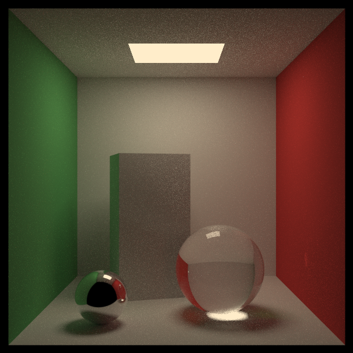
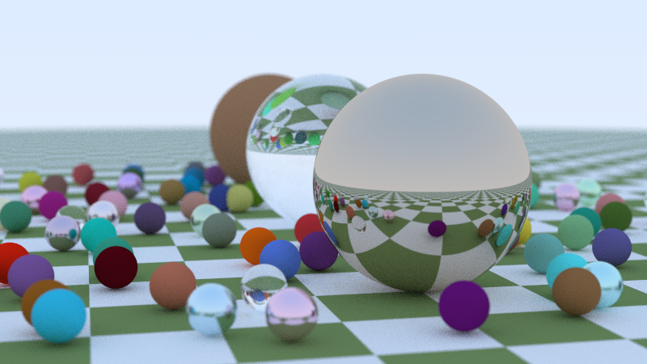
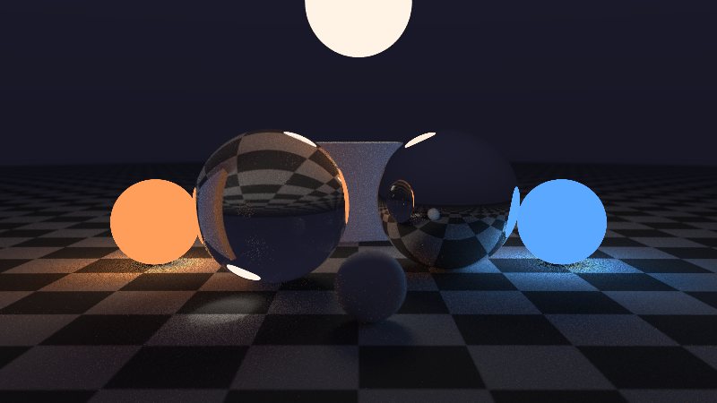

# ✨ Lumière — un moteur de rendu photoréaliste

**Lumière** fabrique des images réalistes en simulant le trajet de la lumière, rayon par rayon.
C'est un *path tracer*, la même technique que celle des films d'animation modernes, écrit en
Python avec NumPy pour calculer des milliers de rayons à la fois, sur tous les cœurs du processeur.



*La boîte de Cornell, une seule lampe au plafond. Personne n'a programmé les ombres douces, le rouge et
le vert qui déteignent sur les objets blancs, ni la tache de lumière sous la sphère de verre :
ils apparaissent tout seuls, parce que la lumière est simulée comme dans la réalité.*





## 🚀 Essayer

```bash
pip install numpy
python3 -m lumiere scenes                                     # liste des scènes
python3 -m lumiere rendre cornell                             # image dans lumiere/rendus/cornell.png
python3 -m lumiere rendre billes --largeur 1280 --echantillons 256
```

| Option | Effet |
|--------|-------|
| `--largeur 1280` | taille de l'image (la hauteur suit en 16/9, ou carré pour `cornell`) |
| `--echantillons 256` | rayons par pixel : plus il y en a, moins il y a de grain (et plus c'est long) |
| `--rebonds 20` | nombre maximal de rebonds par rayon |
| `--sortie mon_image.png` | nom du fichier produit |

Durées sur un processeur à 4 cœurs : `nuit` 800×450 en 256 rayons par pixel prend environ 2 minutes, `billes`
800×450 en 128 rayons environ 6 minutes, `cornell` 600×600 en 256 rayons environ 10 minutes.

## ✨ Ce qu'il sait faire

- 🎨 **Matériaux** : mat (`diffus`), `metal` (miroir ou brossé), `verre` (avec réflexion de Fresnel), `lumiere`, `damier`
- 🔵 **Objets** : sphères, quadrilatères (murs, sols, lampes) et boîtes orientables
- 💡 **Éclairage global** : la lumière rebondit d'objet en objet, jusqu'à 10 fois
- 🎯 **Échantillonnage direct des lampes** : même les petites lampes éclairent sans grain
- 📷 **Caméra réaliste** : champ de vision, flou de profondeur (comme l'ouverture d'un objectif photo), anticrénelage
- 🖼️ **PNG écrit à la main** (avec `zlib`), sans bibliothèque d'image

## 🎬 Créer ta propre scène

Ajoute une fonction dans `lumiere/scenes.py` puis déclare-la dans `SCENES` :

```python
def ma_scene():
    """Une sphère dorée et une sphère de verre sur un damier."""
    scene = Scene(camera=Camera(position=(0, 1, 5), cible=(0, 0.5, 0), champ=40))
    scene.ajouter(
        Sphere((0, -1000, 0), 1000, damier((0.9, 0.9, 0.9), (0.1, 0.1, 0.1))),
        Sphere((-1, 0.5, 0), 0.5, metal((1.0, 0.8, 0.3), flou=0.1)),   # or
        Sphere((1, 0.5, 0), 0.5, verre(1.5)),
        Quad((-1, 3, -1), (2, 0, 0), (0, 0, 2), lumiere(intensite=5)),  # une lampe au-dessus
    )
    return scene

SCENES["ma_scene"] = ma_scene
```

## 🔬 Comment ça marche

```
caméra ──rayon──► objet mat ──rebond au hasard──► mur rouge ──rebond──► ciel
                      │                               │
                      └── rayon d'ombre vers la lampe ─┘  (+ lumière directe à chaque rebond mat)
```

1. **Rayons de caméra** (`moteur.py`, `rayons_camera`) : pour chaque pixel, un rayon part de la caméra, avec un
   petit décalage aléatoire pour adoucir les bords (anticrénelage) et, si on le veut, depuis un point de l'objectif
   (flou de profondeur).
2. **Intersections** (`intersecter`) : on calcule où chaque rayon touche une sphère (une équation du second degré)
   ou un quadrilatère (un plan, puis un test « dedans ou dehors »). On garde l'objet le plus proche.
3. **Rebonds** (`tracer`) : selon le matériau, le rayon repart :
   - **mat** : dans une direction au hasard, plus souvent proche de la normale (loi de Lambert) ;
   - **métal** : en miroir, plus ou moins brouillé ;
   - **verre** : dévié (loi de Snell-Descartes) ou reflété (coefficients de Fresnel), au hasard selon l'angle.
   À chaque rebond, la couleur de la surface filtre la lumière transportée.
4. **Échantillonnage direct** (`lumiere_directe`) : sur une surface mate, on vise aussi un point au hasard d'une
   lampe, et on ajoute sa lumière si aucun objet ne la cache. C'est ce qui fait disparaître le grain.
5. **Roulette russe** : après 3 rebonds, les rayons qui ne transportent presque plus rien sont arrêtés au hasard,
   et les survivants sont renforcés pour compenser. Le calcul reste juste en moyenne, mais va plus vite.
6. **Méthode de Monte-Carlo** : chaque rayon donne une estimation bruitée. La moyenne de centaines de rayons par
   pixel converge vers la vraie image. C'est pour ça que l'image est granuleuse avec peu d'échantillons.
7. **Affichage** (`image.py`) : correction gamma pour nos yeux, puis écriture du PNG.

Les tests (`tests/test_lumiere.py`) vérifient la physique : le test du « four blanc » (l'énergie est conservée) et
l'égalité, en moyenne, des résultats avec et sans échantillonnage direct des lampes.

## 💡 Pistes pour aller plus loin

- Charger des **modèles 3D** (fichiers `.obj`, faits de triangles)
- Une **hiérarchie de volumes englobants** (BVH) pour afficher des milliers d'objets rapidement
- Des **textures** à partir d'images, et une image d'environnement (HDRI) comme ciel
- Du **brouillard** et de la fumée (milieux participants)
- Un **débruiteur**, ou faire tourner le calcul sur carte graphique
