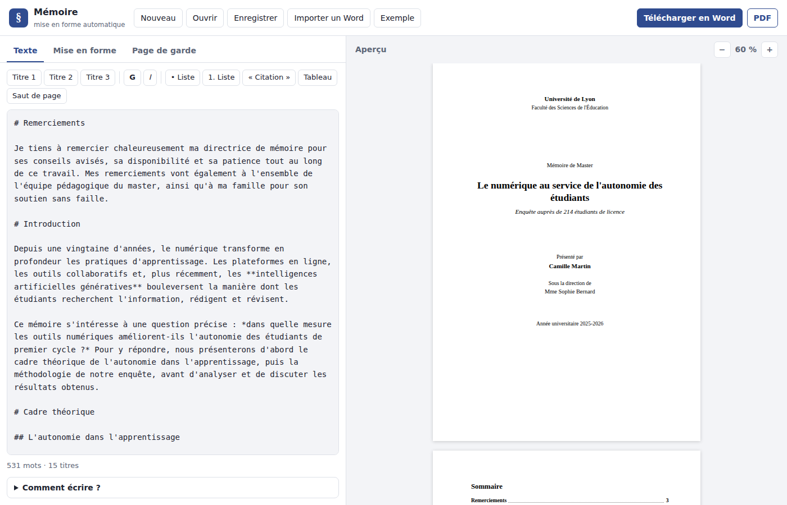

# § Mémoire — la mise en forme automatique de ton mémoire

Tu écris ton texte, la plateforme s'occupe de la mise en forme : **police, taille, interligne, alignement
justifié, retraits, marges, numérotation des titres, sommaire, numéros de page et page de garde**.
Tu récupères un fichier **Word (.docx)**, que tu peux encore modifier, ou un **PDF** prêt à imprimer.



## 🚀 Lancer la plateforme

```bash
pip install reportlab        # seulement pour l'export PDF ; le reste n'a besoin que de Python
python3 -m memoire
```

Le navigateur s'ouvre sur `http://127.0.0.1:8050/`. Tout se passe sur ton ordinateur : ton texte n'est envoyé
nulle part. Il est gardé automatiquement dans le navigateur, et le bouton **Enregistrer** télécharge le projet
(`.json`) pour le rouvrir plus tard ou sur un autre ordinateur.

## ✍️ Écrire son texte

| Tu écris | Tu obtiens |
|----------|------------|
| `# Titre` | un titre de chapitre (niveau 1), numéroté automatiquement |
| `## Titre` / `### Titre` | une sous-partie / une sous-sous-partie |
| `**gras**` / `*italique*` | **gras** / *italique* |
| `- élément` / `1. élément` | une liste à puces / numérotée |
| `> texte` | une citation longue, en retrait |
| `\| A \| B \|` puis `\|---\|---\|` | un tableau (la première ligne est l'en-tête) |
| `---saut de page---` | un saut de page |
| `# Avant-propos {-}` | un titre sans numéro |

Les titres « Introduction », « Conclusion », « Remerciements », « Résumé », « Bibliographie », « Annexes »…
ne sont jamais numérotés, comme le veut l'usage. Une barre d'outils insère tout cela en un clic, et
**Ctrl+B** / **Ctrl+I** mettent la sélection en gras ou en italique.

Tu as déjà ton texte dans Word ? **Importer un Word** récupère les titres (s'ils utilisent les styles
« Titre 1, 2, 3 »), les paragraphes, le gras, l'italique et les listes.

## 🎨 Les réglages

| Réglage | Par défaut (norme « Université ») |
|---------|-----------------------------------|
| Police et taille | Times New Roman, 12 pt (aussi : Arial, Calibri, Garamond, Georgia, Cambria) |
| Interligne | 1,5 ligne |
| Alignement | justifié, retrait de première ligne de 1,25 cm, 6 pt après chaque paragraphe |
| Marges | 2,5 cm, et 3 cm à gauche pour la reliure |
| Numérotation des titres | 1. / 1.1. / 1.1.1., ou I. / A. / 1., avec un mot facultatif (« Chapitre », « Partie ») |
| Titres | taille et couleur de chaque niveau, chaque chapitre sur une nouvelle page |
| Sommaire | automatique, sur 1 à 3 niveaux, avec points de conduite et numéros de page |
| Numéros de page | en bas au centre ou à droite, jamais sur la page de garde |
| Page de garde | université, faculté, type de mémoire, titre, sous-titre, auteur, direction, année |

Des **normes prêtes à l'emploi** règlent tout d'un coup : « Université (standard français) », « APA 7ᵉ édition »,
« Moderne et sobre » et « Plan à la française (I. A. 1.) ». Vérifie toujours les consignes de ton université !

## 📄 Les fichiers produits

- **Word (.docx)** : un vrai document Word, pas une simple copie. Les titres utilisent les styles « Titre 1, 2, 3 »,
  la numérotation est automatique (si tu ajoutes un chapitre dans Word, les numéros suivent), et le sommaire est un
  vrai champ « Table des matières ». **À l'ouverture, Word propose de mettre à jour les champs : accepte**, et le
  sommaire se remplit avec les numéros de page. (Dans LibreOffice : *Outils → Mettre à jour → Tout mettre à jour*.)
- **PDF** : prêt à imprimer ou à déposer, avec le sommaire et ses numéros de page, et des signets pour naviguer
  entre les chapitres. Les polices Microsoft absentes sont remplacées par leurs équivalents libres, aux dimensions
  identiques (Liberation Serif pour Times New Roman, Liberation Sans pour Arial, Carlito pour Calibri).

Sans interface, en ligne de commande :

```bash
python3 -m memoire convertir mon_memoire.md --docx memoire.docx --pdf memoire.pdf --projet projet-memoire.json
```

## 🔬 Comment ça marche

| Fichier | Rôle |
|---------|------|
| `source.py` | lit le texte et le découpe en blocs (titres, paragraphes, listes…), numérote les titres, importe les `.docx` |
| `reglages.py` | les réglages, leurs limites et les normes prêtes à l'emploi |
| `docx.py` | écrit le fichier Word à la main : un `.docx` est une archive ZIP de fichiers XML (texte, styles, numérotation, pied de page) |
| `pdf.py` | met le mémoire en page en PDF avec reportlab, en deux passes pour connaître la page de chaque titre |
| `apercu.py` | l'aperçu HTML, avec la même mise en forme |
| `serveur.py` et `web/` | la plateforme : un petit serveur local et l'interface (HTML, CSS, JavaScript sans bibliothèque) |

Les fichiers Word produits ont été vérifiés en les ouvrant dans LibreOffice : styles, numérotation automatique,
sommaire mis à jour avec les bons numéros de page, et aucune page blanche.

## 💡 Pistes pour aller plus loin

- Les **notes de bas de page** et les **images** avec légende
- Une **bibliographie** automatique (normes APA, ISO 690) à partir d'une liste de références
- Des tables des **figures** et des **tableaux**
- Une numérotation des pages en chiffres romains pour les pages avant l'introduction
