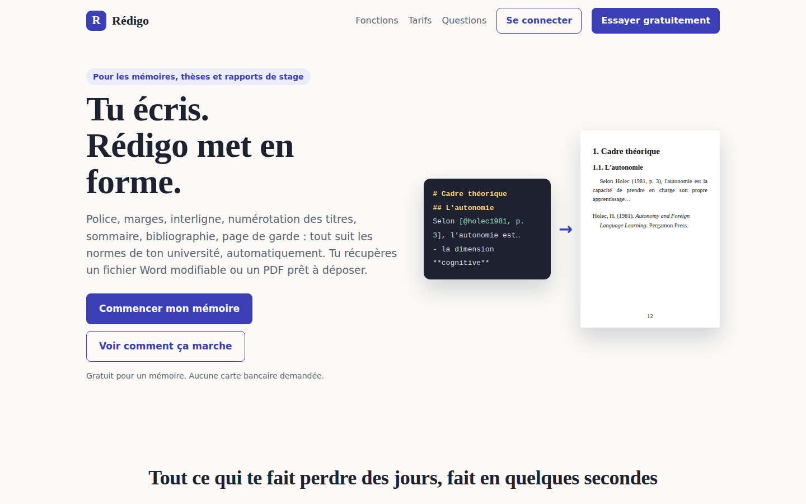
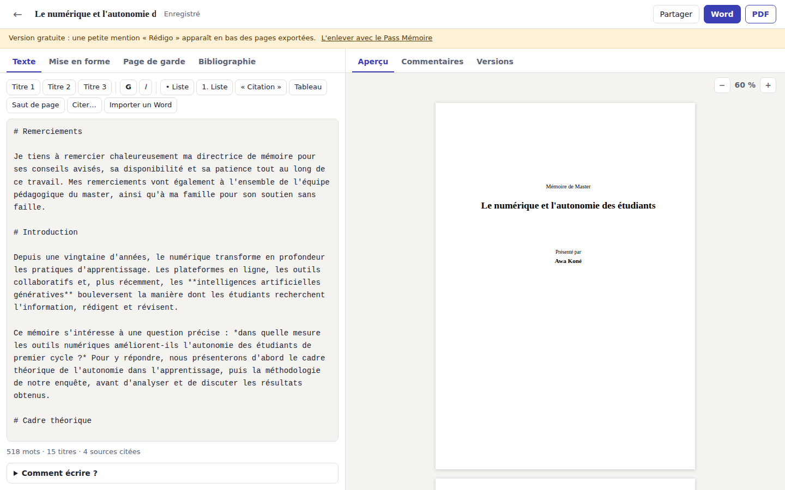
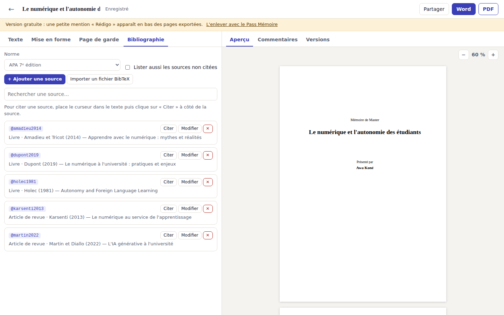
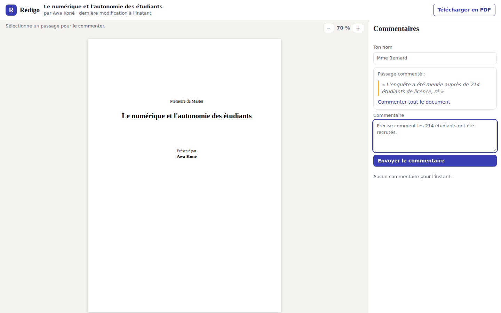

# ✍️ Rédigo — la mise en forme de mémoires, en ligne

**Rédigo** est la version en ligne (SaaS) de la plateforme [Mémoire](../memoire/README.md) : chaque étudiant a son
compte et ses mémoires, sa bibliographie est rédigée automatiquement, sa direction de mémoire commente par un simple
lien, et les formules payantes financent le service.



## ✨ Ce que fait Rédigo

| | |
|---|---|
| 👤 **Comptes** | inscription, connexion, mot de passe oublié (lien valable une heure), export de toutes ses données, suppression du compte |
| 📚 **Plusieurs mémoires** | tableau de bord, enregistrement automatique pendant la frappe, protection contre les modifications simultanées dans deux onglets |
| 🎨 **Mise en forme** | tout le moteur de *Mémoire* : normes, police, marges, numérotation, sommaire, page de garde, export Word et PDF |
| “ ” **Bibliographie automatique** | sources saisies ou importées en BibTeX (Zotero, Mendeley, Google Scholar), citations `[@cle, p. 12]`, liste des références en **APA 7** ou **ISO 690** |
| 💬 **Direction du mémoire** | un lien secret, sans compte : lecture de la dernière version, commentaires sur un passage sélectionné, réponses, « résolu » |
| ↺ **Versions** | versions automatiques toutes les 10 minutes d'écriture, versions nommées (« envoyée au directeur »), retour en arrière sans rien perdre |
| 🗂️ **Modèles** | modèles de mise en forme personnels, et le modèle officiel de l'université pour ses étudiants |
| 💳 **Formules** | Gratuit, Pass Mémoire (paiement unique avec Stripe), licence université (activée par le domaine de l'adresse e-mail) |



## 🚀 Lancer Rédigo sur son ordinateur

```bash
pip install reportlab     # pour l'export PDF
python3 -m redigo         # puis ouvrir http://127.0.0.1:8060/
```

Sans configuration, Rédigo fonctionne en **mode démonstration** : la base de données est créée dans
`redigo/donnees/`, les e-mails (mot de passe oublié) s'affichent dans la console, et le bouton « Obtenir le Pass »
l'active sans paiement.

## 📝 Citer ses sources

| Tu écris | Tu obtiens (APA 7) |
|----------|--------------------|
| `[@dupont2020]` | (Dupont, 2020) |
| `[@dupont2020, p. 12]` | (Dupont, 2020, p. 12) |
| `[@dupont2020; @martin2019]` | (Dupont, 2020 ; Martin, 2019) |
| `@dupont2020 montre que…` | Dupont (2020) montre que… |
| `[bibliographie]` | la liste des références, à cet endroit |

Sans `[bibliographie]`, la liste se place sous ton titre « Bibliographie » (ou « Références »), sinon dans un
nouveau chapitre, juste avant les annexes. Deux ouvrages du même auteur la même année deviennent « 2020a » et
« 2020b ». Une clé inconnue est signalée sous l'éditeur au lieu d'être remplacée en silence.



## 💬 Le lien pour la direction du mémoire

**Partager → Créer un lien** : la personne qui reçoit le lien voit l'aperçu du mémoire et peut télécharger le PDF.
Elle sélectionne un passage pour le commenter. Les commentaires apparaissent chez l'étudiant, qui retrouve le
passage d'un clic, répond et marque la remarque comme résolue. Le lien ne donne accès à rien d'autre et peut être
désactivé à tout moment.



## 💳 Les formules

| | Gratuit | Pass Mémoire | Licence université |
|---|---|---|---|
| Prix | 0 € | 9,90 €, une fois, pour 12 mois | sur devis |
| Mémoires | 1 | 20 | 20 |
| Mention « Rédigo » en bas des pages exportées | oui | non | non |
| Versions automatiques gardées | 5 | 200 | 200 |

Les prix et les limites sont dans `base.py` (`FORMULES`, `PRIX_PASS`).

Les **licences université** se gèrent en ligne de commande. Toutes les adresses du domaine (et de ses
sous-domaines, comme `etu.univ-lyon.fr`) en profitent aussitôt :

```bash
python3 -m redigo licence ajouter univ-lyon.fr "Université de Lyon" 2027-08-31 --norme apa
python3 -m redigo licence liste
python3 -m redigo pass etudiant@exemple.fr       # offrir un Pass Mémoire
```

## 🌍 Mettre Rédigo en ligne

Rédigo n'a besoin que de Python, de reportlab et d'un disque pour la base SQLite. On le place derrière un serveur
HTTPS (Caddy, Nginx…) :

```bash
docker build -f redigo/Dockerfile -t redigo .
docker run -d -p 8060:8060 -v redigo-donnees:/donnees \
  -e REDIGO_URL=https://redigo.exemple.fr \
  -e STRIPE_SECRET_KEY=sk_live_… -e STRIPE_WEBHOOK_SECRET=whsec_… \
  -e REDIGO_SMTP_HOTE=smtp.exemple.fr -e REDIGO_SMTP_UTILISATEUR=… -e REDIGO_SMTP_MOT_DE_PASSE=… \
  redigo
```

| Variable | Rôle |
|----------|------|
| `REDIGO_URL` | l'adresse publique (pour les liens de partage, les e-mails et les cookies `Secure` en HTTPS) |
| `REDIGO_BASE` | le fichier de la base SQLite |
| `STRIPE_SECRET_KEY`, `STRIPE_WEBHOOK_SECRET` | le paiement. Dans Stripe, le webhook pointe vers `https://…/api/paiement/webhook` avec l'événement `checkout.session.completed` |
| `REDIGO_DEMO` | `1` : Pass sans paiement (par défaut s'il n'y a pas de clé Stripe, sauf dans l'image Docker) |
| `REDIGO_SMTP_HOTE`, `_PORT`, `_UTILISATEUR`, `_MOT_DE_PASSE`, `_EXPEDITEUR` | l'envoi des e-mails |
| `REDIGO_DERRIERE_PROXY` | `1` : l'adresse du visiteur est lue dans `X-Forwarded-For` (pour limiter les tentatives de connexion) |

Pense à sauvegarder régulièrement le volume `/donnees`.

## 🔐 Sécurité

- Mots de passe hachés avec **scrypt** et un sel par compte. Les jetons de session et de réinitialisation sont
  gardés hachés : une copie volée de la base ne permet pas de se connecter.
- Cookie de session `HttpOnly`, `SameSite=Lax`, et `Secure` en HTTPS. Toute requête qui modifie quelque chose doit
  porter l'en-tête `X-Redigo`, qu'un autre site ne peut pas ajouter (protection CSRF).
- Chaque mémoire n'est accessible qu'à son auteur : un identifiant qui ne lui appartient pas renvoie « introuvable ».
  Les liens de partage sont des jetons aléatoires de 256 bits.
- En-têtes `Content-Security-Policy` (aucun script extérieur ni en ligne), `X-Frame-Options`, `nosniff`,
  `Referrer-Policy: no-referrer`. Tout texte affiché est échappé.
- Nombre de tentatives limité : connexion, inscription, mot de passe oublié, commentaires et exports des liens de partage.
- Les notifications de Stripe sont vérifiées (signature HMAC et date), et un même paiement n'est jamais compté deux fois.
- La carte bancaire est saisie chez Stripe : elle ne passe jamais par Rédigo.

## 🔬 Comment c'est construit

| Fichier | Rôle |
|---------|------|
| `serveur.py` | le serveur HTTP et toute l'API (bibliothèque standard de Python uniquement) |
| `base.py` | la base SQLite : comptes, sessions, mémoires, versions, sources, partages, commentaires, licences, paiements |
| `bibliographie.py` | les citations, les normes APA 7 et ISO 690, l'import BibTeX |
| `securite.py` | le hachage des mots de passe, les jetons, la limitation des tentatives |
| `paiement.py` | Stripe Checkout et la vérification des webhooks |
| `courriel.py` | l'envoi des e-mails |
| `web/` | la page d'accueil, l'application et la page de la direction (HTML, CSS et JavaScript sans bibliothèque) |

La mise en forme elle-même (Word, PDF, aperçu) est celle du module [`memoire`](../memoire/README.md), auquel Rédigo
ajoute les références bibliographiques (avec retrait négatif) et la mention de la version gratuite.

## ✅ Tests

```bash
python3 -m unittest tests.test_redigo
```

Ils couvrent les normes bibliographiques, l'import BibTeX, les formules et les licences, les paiements (une
notification reçue deux fois ne compte qu'une fois), les signatures Stripe, et un parcours complet par l'API :
inscription, mémoire, sources, exports, versions, partage, commentaires, Pass. Ils vérifient aussi qu'un utilisateur
ne peut pas voir le mémoire d'un autre.

## 💡 Pistes pour aller plus loin

- Un **tableau de bord pour les universités** : suivi des mémoires, statistiques, modèle officiel modifiable en ligne
- Les **notes de bas de page**, les **figures** avec légende et la table des figures
- Des **notifications par e-mail** quand la direction commente
- La **détection de passages non cités** (comparaison avec les sources)
- PostgreSQL à la place de SQLite pour servir des milliers d'étudiants en même temps
