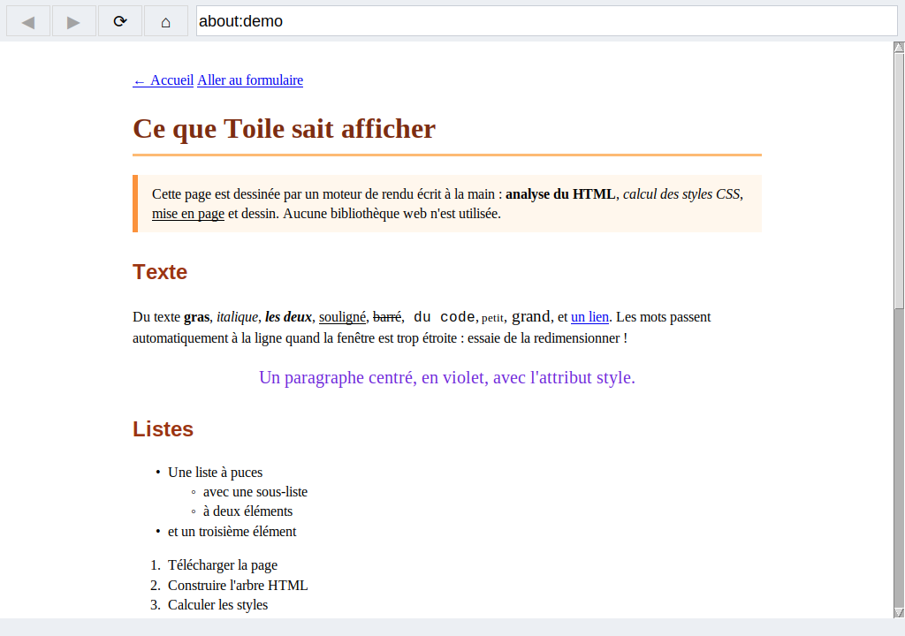

# 🕸️ Toile — un navigateur web écrit à partir de zéro

**Toile** est un navigateur web complet, écrit en Python sans aucune bibliothèque web. Il parle lui-même
le protocole HTTP, analyse le HTML, calcule les styles CSS, met la page en forme et la dessine dans une fenêtre.



## 🚀 Lancer le navigateur

```bash
python3 -m toile                          # page d'accueil
python3 -m toile about:demo               # page de démonstration
python3 -m toile https://example.com      # un vrai site
python3 -m toile ma_page.html             # un fichier sur ton ordinateur
```

Il faut seulement Python avec Tkinter (inclus avec Python sur Windows et macOS ; sur Linux : `sudo apt install python3-tk`).

**Sans fenêtre** (avec [Pillow](https://pypi.org/project/pillow/) : `pip install pillow`) :

```bash
python3 -m toile https://example.com --capture page.png --largeur 1000   # capture d'écran de toute la page
python3 -m toile https://example.com --texte                             # juste le texte, dans le terminal
```

| Raccourci | Action |
|-----------|--------|
| Molette, ↑ ↓, Page ↑ ↓, Espace, Début, Fin | faire défiler |
| Clic sur un lien | ouvrir la page (ou aller à l'ancre `#section`) |
| Alt + ← / Alt + → | page précédente / suivante |
| F5 | recharger |
| Ctrl + L | aller dans la barre d'adresse |

## ✨ Ce qu'il sait faire

- 🌐 **Réseau** : HTTP et HTTPS écrits à la main sur des *sockets*, redirections, compression gzip,
  envoi « par morceaux » (*chunked*), proxy, fichiers locaux, adresses `data:` et pages intégrées `about:`
- 🌳 **HTML** : arbre du document, entités (`&eacute;`), balises oubliées ou mal fermées corrigées comme dans les vrais navigateurs
- 🎨 **CSS** : feuilles `<style>`, fichiers externes `<link>` et attributs `style=""` ; sélecteurs de balise, `.classe`,
  `#id`, descendant (`nav a`) et enfant (`ul > li`) ; spécificité, héritage, `inherit` ; couleurs (noms, `#rgb`, `rgb()`) ;
  unités `px`, `em`, `rem`, `%`, `pt`
- 📐 **Mise en page** : blocs et texte en ligne, retour à la ligne automatique, marges (avec fusion), bordures,
  remplissage, largeur, `max-width`, centrage `margin: auto`, `text-align`, `line-height`, `white-space: pre`,
  listes à puces et numérotées, `display: none`
- 🖱️ **Fenêtre** : barre d'adresse, historique, liens cliquables, adresse du lien au survol, défilement,
  redimensionnement avec remise en page
- 📝 **Formulaires et images** : dessinés comme des boîtes (champ de texte, case à cocher, liste, bouton, texte alternatif)

## 🔬 Comment ça marche

```
adresse ─► reseau.py ─► HTML ─► html.py ─► arbre (DOM) ─► css.py ─► arbre stylé
                                                                        │
          fenêtre (fenetre.py) ou image PNG (capture.py) ◄── dessins ◄─ mise_en_page.py
```

1. **Réseau** (`reseau.py`) : ouvre une connexion TCP, la chiffre avec TLS pour HTTPS, écrit la requête
   `GET /chemin HTTP/1.1`, puis lit la ligne de statut, les en-têtes et le corps de la réponse.
2. **HTML** (`html.py`) : découpe le texte en balises et en texte, puis les range dans un arbre grâce à une pile des
   balises ouvertes. Il ajoute les `<html>`, `<head>` et `<body>` oubliés, et ferme les `<p>` et `<li>` laissés ouverts.
3. **CSS** (`css.py`) : lit les règles, puis calcule pour chaque élément la valeur de chaque propriété. Il prend les
   règles qui correspondent, les trie par spécificité puis par ordre d'écriture, et hérite du parent pour la couleur ou
   la police. La feuille `navigateur.css` donne l'apparence par défaut (titres en gras, liens bleus…).
4. **Mise en page** (`mise_en_page.py`) : calcule la position de chaque boîte. Les blocs s'empilent verticalement,
   et les mots se rangent sur des lignes, avec un retour à la ligne quand il n'y a plus de place.
5. **Dessin** : la mise en page produit une liste d'ordres (« rectangle ici », « texte là ») que la fenêtre Tkinter
   (`fenetre.py`) ou Pillow (`capture.py`) exécute. Pour mesurer le texte, `polices.py` s'adapte à l'un ou l'autre.

## 🧪 Tests

```bash
python3 -m unittest tests.test_toile
```

Les tests lancent un petit serveur local pour vérifier les redirections, la compression gzip, l'envoi par morceaux
et les feuilles de style externes. Toile a aussi été essayé sur un vrai site en HTTPS (la page de NumPy sur pypi.org).

## 🚧 Limites

Toile ne sait pas encore exécuter **JavaScript**, afficher les **images**, ni gérer les **tableaux**, **flexbox**,
**grid**, le **positionnement** (`position: absolute`), `float` ou les pseudo-classes comme `:hover`.
Les sites modernes s'affichent donc de façon simplifiée, souvent dans l'ordre de leur code HTML.

## 💡 Pistes pour aller plus loin

- Afficher les **images** PNG et GIF (Tkinter sait les lire)
- Des **onglets**, des **favoris** et un **historique** enregistré
- Envoyer les **formulaires** (requêtes `POST`)
- Les **tableaux** et `display: flex`
- Un petit interpréteur **JavaScript**… ou brancher **Fouineur** comme moteur de recherche par défaut !
